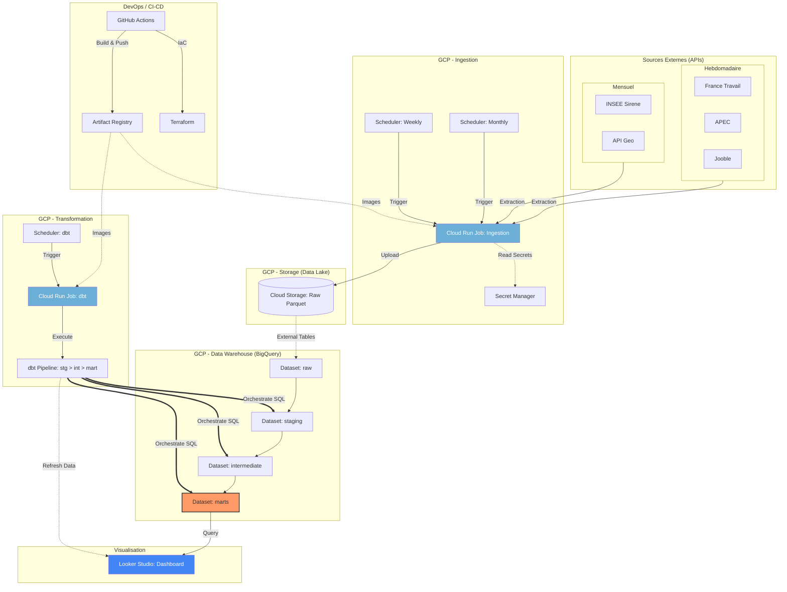

# Architecture du Projet

Ce document présente l'architecture technique du pipeline de données pour la cartographie du marché Data Engineer en France.

## Schéma Global

## Description des Composants

### 1. Ingestion
Les scripts Python (`src/ingestion/`) sont encapsulés dans des conteneurs Docker et exécutés comme des **Cloud Run Jobs**.
- **Flux Hebdomadaire (Lundi)** : Récupération des offres d'emploi pour France Travail, APEC et Jooble.
- **Flux Mensuel (1er du mois)** : Mise à jour des référentiels Sirene et Geo.

### 2. Stockage (Data Lake)
Les données sont persistées sur **Google Cloud Storage** au format **Parquet**. Le partitionnement est de type Hive : `dt=YYYY-MM-DD`.

### 3. Transformation (ELT)
Le projet utilise **dbt** pour transformer les données directement au sein de **BigQuery**.
- **raw** : Tables externes sur GCS.
- **staging** : Nettoyage technique.
- **intermediate** : Logique métier (jointures, enrichissement géographique).
- **marts** : Vues prêtes pour la consommation.

### 4. Orchestration
**Cloud Scheduler** gère le planning :
- **Ingestion Weekly** : Lundi matin pour les offres d'emploi.
- **Ingestion Monthly** : 1er du mois pour les entreprises et la géographie.
- **Job dbt** : Exécuté après les ingestions pour mettre à jour les tableaux de bord.

### 5. Infrastructure
L'ensemble de l'infrastructure est défini par du code (**Terraform**) situé dans le dossier `infra/`.
